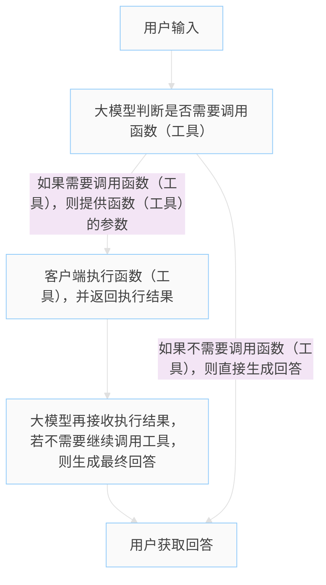

# 函数（工具）调用

---

大模型函数调用主要包含两个部分：
  1. 大模型需要接收函数（工具）的信息作为上下文，在回答用户的问题时判断是否需要调用函数（工具）；
  2. 决定使用工具时，大模型需要根据函数（工具）的信息提供函数（工具）所需的参数。客户端得到这些参数后执行函数（工具），并将执行结果返回给大模型，大模型再根据执行结果生成回答。

:::tip 说明
函数（工具）信息包括函数（工具）的名称、功能描述、参数说明、返回值说明等信息。

:::


以上流程说明在需要使用工具的情况下，大模型需要和客户端至少进行两次交互：
  1. 接收用户输入
  2. 接收函数（工具）调用结果 

## 函数（工具）调用示例

以 [Qwen AI](https://bailian.console.aliyun.com/?spm=5176.29597918.nav-v2-dropdown-menu-0.d_main_1_0_9.56737b08m0TX0q&tab=doc&scm=20140722.M_10904471._.V_1#/doc/?type=model&url=2862208) （兼容 OpenAI ）为例，实现一个函数（工具）调用示例。

**工具函数**

客户端准备好工具函数，并封装成 tool 对象。

```ts
// 模拟获取当前天气的工具函数
function getCurrentWeather(location: string): string {
  console.log("调用工具get_current_weather")
  return `当前${location}的天气是晴天`;
}

// 封装成 tool 对象
const tools: ChatCompletionTool[] = [ 
// 工具函数：获取指定城市的天气
{
  type: "function",
  function: {
    name: "get_current_weather", // 工具函数名称
    description: "当你想查询指定城市的天气时非常有用。", // 工具函数描述
    parameters: {  // 工具函数参数
      type: "object", // 参数类型为对象
      properties: { // 参数属性
        location: { // 参数属性名称
          type: "string", // 参数属性类型
          description: "城市或县区，比如北京市、杭州市、余杭区等。" // 参数属性描述
        }
      },
      required: ["location"] // 必填的参数属性
    }
  }
}];

// 工具函数映射表
const toolFunctions: Record<string, (args: string) => string> = { 
  get_current_weather: getCurrentWeather
}

```

**AI 调用工具函数**

由大模型提供参数，客户端中使用这些参数来执行工具函数，并将执行结果返回给大模型，大模型再根据执行结果生成回答。
```ts
async function getLLMResponse(messages: Message[]) {
  const response = await openai.chat.completions.create({
      model: MODEL_NAME ?? "qwen-plus",  //此处以qwen-plus为例，可按需更换模型名称。模型列表：https://help.aliyun.com/zh/model-studio/getting-started/models
      messages,
      tools,
      tool_choice: "auto",
  });
  return response
}

rl.question("请输入问题：", async (question) => {
  const messages: Message[] = [
    { role: "system", content:"你是一个 AI 助手，请根据用户的问题进行回答。" },
    { role: "user", content: question }
  ];
  const response = await getLLMResponse(messages) 
  messages.push(response.choices[0].message) // 将大模型的返回的内容加入到messages中
  // 需要使用工具
  if(response.choices[0].message.tool_calls){
    // 获取工具调用信息
      const toolCalls = response.choices[0].message.tool_calls
      const toolCallFunctions = toolCalls.map(toolCall => toolCall.function)
      // 执行工具调用
      const toolCallResults: ChatCompletionMessageParam[] = toolCallFunctions.map(item=>{
        if(item.name in toolFunctions){
          const content = toolFunctions[item.name as keyof typeof toolFunctions](item.arguments)
          return {content: content,role: "tool",tool_call_id: ""}
        }
        return {content: "此工具不存在！",role: "tool",tool_call_id: ""}
      })
      // 将工具调用结果加入到messages中
      const finalResponse = await getLLMResponse([...messages, ...toolCallResults])
      // 输出最终回答
      console.log(finalResponse.choices[0].message.content)
    }else{
      // 不需要使用工具，直接生成回答
      console.log(response.choices[0].message.content)
    }
    rl.close();
});
```

## 图表工具示例

实现一个更加复杂的图表工具函数调用示例。

  - 使用 [chart.js](https://www.chartjs.org/) 生成图表，保存为 html 静态文件。
  - 使用 express 托管 html 静态文件。

- 图表工具函数---生成图表，并返回图表的 html 文件地址。
:::details chart.ts
```ts
import { readFileSync, writeFileSync, mkdirSync, existsSync } from "fs"
import { join } from "path"

// 可以优化为新建html文件，然后返回html文件的url
function generate_chart(args:string){
  console.log("执行图表生成")

  // 构建Chart.js配置对象
  try{
    JSON.parse(args)
  }catch(error:any){
    return "图表生成失败，请检查输入的 json 参数数据是否正确：" + error.message
  }
  
  const chart_config:{
    type: string,
    data: any,
    options?: any,
    locale?: string
  }= JSON.parse(args)

  const chart_html = `<!DOCTYPE html>
<html lang="zh-CN">
<head>
  <meta charset="UTF-8">
  <meta name="viewport" content="width=device-width, initial-scale=1.0">
  <title>图表生成结果</title>
  <style>
    body {
      font-family: 'Segoe UI', Tahoma, Geneva, Verdana, sans-serif;
      margin: 0;
      padding: 20px;
      background: linear-gradient(135deg, #667eea 0%, #764ba2 100%);
      min-height: 100vh;
    }
    .chart-container {
      background: white;
      padding: 30px;
      border-radius: 12px;
      box-shadow: 0 8px 32px rgba(0,0,0,0.1);
      max-width: 900px;
      margin: 0 auto;
      backdrop-filter: blur(10px);
    }
    .chart-title {
      text-align: center;
      color: #333;
      margin-bottom: 20px;
      font-size: 24px;
      font-weight: 600;
    }
    canvas {
      max-width: 100%;
      height: auto;
    }
    .chart-info {
      margin-top: 20px;
      padding: 15px;
      background: #f8f9fa;
      border-radius: 8px;
      font-size: 14px;
      color: #666;
    }
  </style>
</head>
<body>
  <div class="chart-container">
    <h2 class="chart-title">图表生成结果</h2>
    <canvas id="myChart"></canvas>
    <div class="chart-info">
      <strong>图表类型:</strong> ${chart_config.type}<br>
      <strong>生成时间:</strong> ${new Date().toLocaleString('zh-CN')}
    </div>
  </div>

  <script src="https://cdn.jsdelivr.net/npm/chart.js"></script>
  <script>
    // 错误处理
    try {
      const ctx = document.getElementById('myChart');
      if (!ctx) {
        throw new Error('Canvas element not found');
      }

      // Chart.js配置
      const chartConfig = ${JSON.stringify(chart_config, null, 2)};

      // 创建图表
      const chart = new Chart(ctx, chartConfig);

      console.log('图表创建成功', chartConfig);
    } catch (error) {
      console.error('图表创建失败:', error);
      document.querySelector('.chart-container').innerHTML =
        '<h2 style="color: red;">图表创建失败</h2><p>' + error.message + '</p>';
    }
  </script>
</body>
</html>
`
  
  // 将图表html写入assets文件夹
  const distDir = "dist"
  if (!existsSync(distDir)) {
    mkdirSync(distDir, { recursive: true });
  }
  const chart_url = `chart_${Date.now()}.html`
  const fullPath = join(distDir, chart_url);
  writeFileSync(fullPath, chart_html)

  return "以下是图表生成结果，回答时需要带上完整的json数据：" + JSON.stringify(chart_config,null,2)+ "\n 图表的资源地址为：" + chart_url
}

const tool_chart = {
  type: "function" as const,
  function:{
    name: "generate_chart",
    description: "当用户需要生成图表时，可以使用该工具",
    parameters: JSON.parse(readFileSync("chart.config.json", "utf-8"))
  }
} 

export { tool_chart, generate_chart } 
```
:::

### 图表工具函数

图表工具函数的参数配置文件，用于生成图表的配置。

:::warning 注意
图表工具函数的参数即为 chart.js 的使用方法，可通过 AI 分析 [chart.js](https://github.com/chartjs/Chart.js) 的 github 仓库，获取图表的配置方法并生成指定格式的参数配置文件。

其他工具库也可使用此方法快速构造出工具函数的参数配置文件。
:::
:::details chart.config.json
```json
{
  "parameters": {
    "type": "object",
    "properties": {
      "type": {
        "type": "string",
        "description": "图表类型，如line、bar、pie、doughnut、radar、scatter、polarArea、bubble等。"
      },
      "data": {
        "type": "object",
        "description": "图表数据，包含labels和datasets等信息。",
        "properties": {
          "labels": {
            "type": "array",
            "description": "坐标轴标签数组，用于标识数据类别。"
          },
          "datasets": {
            "type": "array",
            "description": "数据集数组，每个数据集包含具体数据及样式配置。",
            "items": {
              "type": "object",
              "properties": {
                "data": {
                  "type": "array",
                  "description": "数据值数组，可直接为数值或包含x、y等属性的对象。"
                },
                "label": {
                  "type": "string",
                  "description": "数据集标签，用于图例显示。"
                },
                "backgroundColor": {
                  "type": "string",
                  "description": "数据元素填充颜色。"
                },
                "borderColor": {
                  "type": "string",
                  "description": "数据元素边框颜色。"
                },
                "borderWidth": {
                  "type": "number",
                  "description": "数据元素边框宽度。"
                }
              }
            }
          }
        }
      },
      "options": {
        "type": "object",
        "description": "图表配置选项，包含布局、缩放、动画等设置。",
        "properties": {
          "responsive": {
            "type": "boolean",
            "description": "是否响应式布局，默认为true。"
          },
          "scales": {
            "type": "object",
            "description": "坐标轴配置，包含x轴、y轴等设置。",
            "properties": {
              "x": {
                "type": "object",
                "description": "x轴配置。",
                "properties": {
                  "type": {
                    "type": "string",
                    "description": "x轴类型，如linear、time、category等。"
                  },
                  "display": {
                    "type": "boolean",
                    "description": "是否显示x轴。"
                  },
                  "min": {
                    "type": "number",
                    "description": "x轴最小值。"
                  },
                  "max": {
                    "type": "number",
                    "description": "x轴最大值。"
                  },
                  "ticks": {
                    "type": "object",
                    "description": "x轴刻度配置。",
                    "properties": {
                      "autoSkip": {
                        "type": "boolean",
                        "description": "是否自动跳过刻度以避免重叠。"
                      },
                      "stepSize": {
                        "type": "number",
                        "description": "刻度间隔步长。"
                      },
                      "minRotation": {
                        "type": "number",
                        "description": "刻度标签最小旋转角度。"
                      },
                      "maxRotation": {
                        "type": "number",
                        "description": "刻度标签最大旋转角度。"
                      }
                    }
                  }
                }
              },
              "y": {
                "type": "object",
                "description": "y轴配置，结构同x轴。"
              }
            }
          },
          "layout": {
            "type": "object",
            "description": "图表布局配置。",
            "properties": {
              "padding": {
                "type": "object",
                "description": "图表内边距。",
                "properties": {
                  "left": {
                    "type": "number",
                    "description": "左内边距。"
                  },
                  "right": {
                    "type": "number",
                    "description": "右内边距。"
                  },
                  "top": {
                    "type": "number",
                    "description": "上内边距。"
                  },
                  "bottom": {
                    "type": "number",
                    "description": "下内边距。"
                  }
                }
              }
            }
          },
          "animation": {
            "type": "object",
            "description": "动画配置。",
            "properties": {
              "duration": {
                "type": "number",
                "description": "动画持续时间（毫秒）。"
              },
              "easing": {
                "type": "string",
                "description": "动画缓动函数。"
              }
            }
          },
          "plugins": {
            "type": "object",
            "description": "插件配置，如图例、标题等。",
            "properties": {
              "legend": {
                "type": "object",
                "description": "图例配置。",
                "properties": {
                  "display": {
                    "type": "boolean",
                    "description": "是否显示图例。"
                  }
                }
              }
            }
          },
          "parsing": {
            "type": "object",
            "description": "数据解析配置，用于自定义数据属性映射。",
            "properties": {
              "xAxisKey": {
                "type": "string",
                "description": "映射到x轴的数据属性键名。"
              },
              "yAxisKey": {
                "type": "string",
                "description": "映射到y轴的数据属性键名。"
              },
              "key": {
                "type": "string",
                "description": "用于饼图等类型的数值属性键名。"
              }
            }
          }
        }
      },
      "locale": {
        "type": "string",
        "description": "国际化配置，使用BCP 47语言标签，基于Intl.NumberFormat。"
      }
    },
    "required": ["type", "data"]
  }
}
```
:::

### 使用 express 托管 html 静态资源

:::details server.ts
```ts
import express from "express";

const app = express();

app.use(express.json());
// app.use(express.urlencoded({ extended: true }));
app.use(express.static("dist"));

export default app;
```
:::

### 环境变量文件
:::details .env
```bash
# 百炼API Key
API_KEY=[your API_KEY]
# 模型名称
MODEL_NAME=qwen3-235b-a22b-instruct-2507
# 模型服务地址
BASE_URL=https://dashscope.aliyuncs.com/compatible-mode/v1
# 静态资源服务端口
PORT=9527
```
:::

### 启动服务

启动静态资源服务，并提供静态资源服务地址。

:::details index.ts
```ts 
import dotenv from "dotenv";
import OpenAI from "openai";
import { ChatCompletionMessageParam, ChatCompletionTool } from "openai/resources/index";
import readline from "readline"
import { tool_chart, generate_chart } from "./src/chart"
import app from "./src/server"

dotenv.config();
const { PORT ,API_KEY ,MODEL_NAME ,BASE_URL } = process.env;

console.log("环境变量已加载：",API_KEY, MODEL_NAME, BASE_URL, PORT);  

const openai = new OpenAI(
  {
      // 若没有配置环境变量，请用百炼API Key将下行替换为：apiKey: "sk-xxx",
      apiKey: API_KEY,
      baseURL: BASE_URL
  }
);
const systemPrompt = `
你是一个AI助手，请根据用户的问题，给出相应的回答。本次的静态资源服务地址为： http://localhost:${PORT}，当有静态资源是需要给用户提示预览地址。
`;

const tools: ChatCompletionTool[] = [
// 工具1 获取当前时刻的时间
{
  "type": "function",
  "function": {
      "name": "get_current_time",
      "description": "当你想知道现在的时间时非常有用。",
      // 因为获取当前时间无需输入参数，因此parameters为空
      "parameters": {}  
  }
},  
// 工具2 获取指定城市的天气
{
  "type": "function",
  "function": {
      "name": "get_current_weather",
      "description": "当你想查询指定城市的天气时非常有用。",
      "parameters": {  
          "type": "object",
          "properties": {
              // 查询天气时需要提供位置，因此参数设置为location
              "location": {
                  "type": "string",
                  "description": "城市或县区，比如北京市、杭州市、余杭区等。"
              }
          },
          "required": ["location"]
      }
    }
  }
];

function getCurrentTime(): string {
  console.log("调用工具get_current_time")
  return `当前时间是${new Date().toLocaleString()}`;
}
function getCurrentWeather(location: string): string {
  console.log("调用工具get_current_weather")
  return `当前${location}的天气是晴天`;
}
const toolFunctions:Record<string, (args: string) => string> = {
  get_current_time: getCurrentTime,
  get_current_weather: getCurrentWeather
}

tools.push(tool_chart)  
toolFunctions.generate_chart = generate_chart

// type Message = {
//   role: "user" | "assistant" | "tool";
//   content: string;
// }

type Message = ChatCompletionMessageParam

async function getLLMResponse(messages: Message[]) {
  const response = await openai.chat.completions.create({
      model: MODEL_NAME ?? "qwen-plus",  //此处以qwen-plus为例，可按需更换模型名称。模型列表：https://help.aliyun.com/zh/model-studio/getting-started/models
      messages,
      tools,
      tool_choice: "auto",
  });
  return response
}

const rl = readline.createInterface({
  input: process.stdin,
  output: process.stdout
});

app.listen(PORT, () => {
  console.log(`开启静态资源服务，服务器在端口${PORT}上运行\nhttp://localhost:${PORT} \n`);
  rl.question("请输入问题：", async (question) => {
    const messages: Message[] = [
      { role: "system", content: systemPrompt },
      { role: "user", content: question }
    ];
    const response = await getLLMResponse(messages);
    // console.log(response.choices[0].message,"\n",response.choices[0].message.tool_calls?.[0].function,"\n",response);
    messages.push(response.choices[0].message) // 将大模型的返回的内容加入到messages中
    if(response.choices[0].message.tool_calls){
      // 需要使用工具
      const toolCalls = response.choices[0].message.tool_calls
      const toolCallFunctions = toolCalls.map(toolCall => toolCall.function)
      const toolCallResults: ChatCompletionMessageParam[] = toolCallFunctions.map(item=>{
        if(item.name in toolFunctions){
          const content = toolFunctions[item.name as keyof typeof toolFunctions](item.arguments)
          // console.log(content,"\n",item.arguments)
          return {content: content,role: "tool",tool_call_id: ""}
        }
        return {content: "此工具不存在！",role: "tool",tool_call_id: ""}
      })
      const finalResponse = await getLLMResponse([...messages, ...toolCallResults])
      console.log(finalResponse.choices[0].message.content)
    }else{
      // 不需要使用工具
      console.log(response.choices[0].message.content)
    }
    rl.close();
    // process.exit(0);
  });
}); 
```
:::
