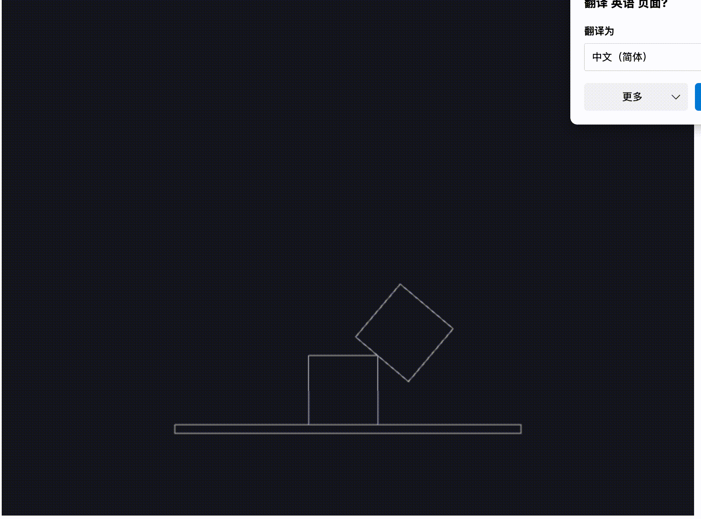
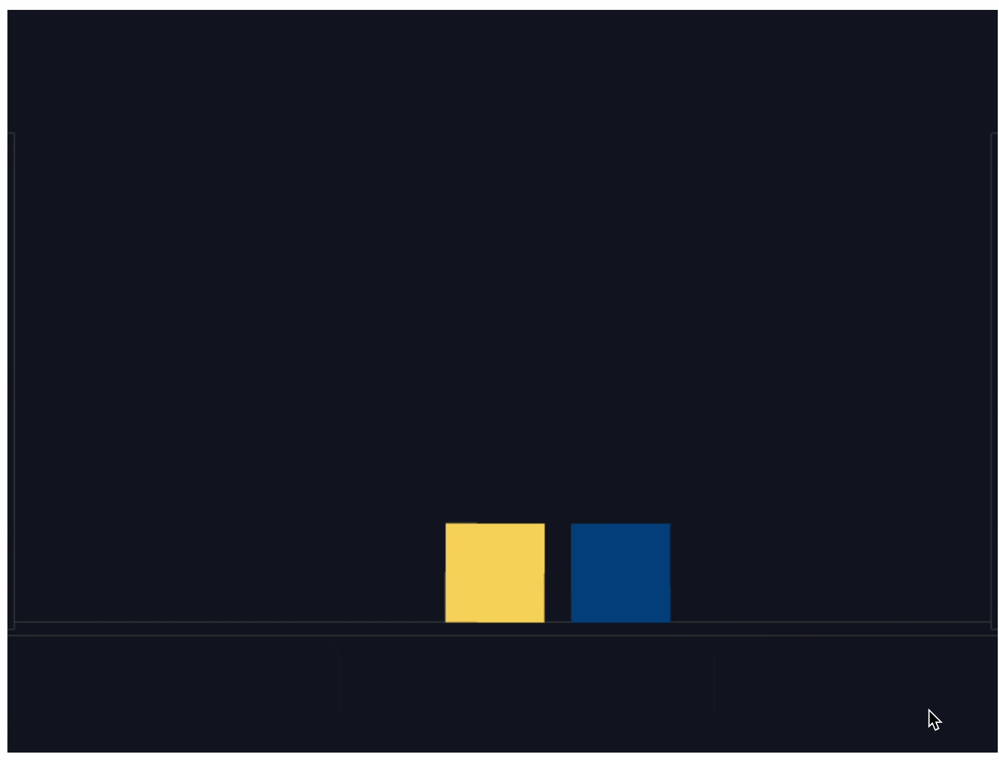

# js 2d物理引擎库 Matter.js

[Matter.js](https://www.brm.io/matter-js/) 是一个用于 JavaScript 的 2D 物理引擎库，用于创建和模拟物理对象的运动。它提供了丰富的功能，包括刚体、约束、力、碰撞检测等，非常适合用于游戏开发、物理模拟和动画效果。

## 原理
模拟计算物理世界中物体的运动，通过计算物体的位置、速度、加速度等物理量，来模拟物体的运动，并将最终的效果在canvas中显示出来

## 核心概念

| 模块名称 | 说明 |
| --- | --- |
| 引擎（Engine） | Engine 是 Matter.js 的核心组件，用于管理物理世界中的所有对象、计算物体的运动和相互作用。用来模拟真实环境的。 |
| 渲染器（Render） | Render 用于将物理世界中的对象可视化。意思就是它能将物体渲染到屏幕上。 |
| 复合体（Composite） | 是包含多个刚体和约束的容器，它们可以作为单个物理对象进行操作。 |
| 刚体（Body） | 表示具有物理属性的实体，如形状、质量和速度等。刚体可以是各种形状，例如矩形、圆形、多边形等。 |
| 约束（Constraint） | 用于约束刚体的相对运动，例如让两个刚体之间的距离保持不变、限制旋转等。 |
| 循环模块（Runner） | Runner 用于管理和控制物理引擎的主循环。 |

1. 引擎（Engine）计算所有物理效果
2. 渲染器（Render）将刚体和物理效果渲染到canvas中
3. 复合体（Composite）将2d世界、多个刚体和约束组合成一个物理对象
4. 刚体（Body）表示具有物理属性的**实体**，如形状、质量和速度等。刚体可以是各种形状，例如矩形、圆形、多边形等。
5. 约束（Constraint）用于约束刚体的相对运动（模拟外力操控物体），例如让两个刚体之间的距离保持不变、限制旋转等。

## 安装

Matter.js 可以通过 npm 安装，也可以直接在 HTML 文件中引入。

```bash
npm install matter-js
```
或者
```html
<script src="https://cdn.bootcdn.net/ajax/libs/matter-js/0.19.0/matter.js"></script>
```

## 示例1

**js代码**
```js
// 参考文章：https://juejin.cn/post/7221550123193811002

const container = document.querySelector('.container'); // 获取容器


// 刚体，复合体，引擎，运行器，渲染器
const { Bodies, Composite, Engine, Runner, Render,Mouse,MouseConstraint } = Matter;

// 创建引擎
const engine = Engine.create();
// 创建渲染器
const render = Render.create({
  element: container, // 展示容器
  engine: engine, // 引擎
});


//  创建两个正方形
let boxA = Bodies.rectangle(400, 200, 80, 80)
let boxB = Bodies.rectangle(450, 50, 80, 80,{
  restitution:0.5, // 弹性系数,默认为0
})

// 创建地面，将isStatic设为true，表示物体静止(一个完全静止的物体)
let ground = Bodies.rectangle( 400, 500,400, 10, { isStatic: true })

// 创建鼠标实例
let mouse = Mouse.create(render.canvas)

// 创建鼠标约束
let mouseConstraint = MouseConstraint.create(engine, {
  mouse: mouse,
  constraint:{
    stiffness:0.5, //一个指定约束的刚度（Number，默认 1），即恢复到静止状态的速率constraint.length。 值为1意味着约束应该非常严格。 值为0.2意味着约束就像一个软弹簧。
    render:{
      visible:false // 不显示约束线(鼠标轨迹)默认可见
    }
  }
})

// 将所有物体添加到世界中
Composite.add(engine.world, [boxA, boxB, ground,mouseConstraint])

// 执行渲染操作
Render.run(render)

// 创建运行器
const runner = Runner.create();// 默认画布800*600

// 将引擎和渲染器添加到运行器中
Runner.run(runner, engine);


```
:::details html
```html
<!DOCTYPE html>
<html lang="en">

<head>
  <meta charset="UTF-8">
  <meta name="viewport" content="width=device-width, initial-scale=1.0">
  <title>2d</title>
</head>

<body>
  <div class="container"></div>
  <script src="./node_modules/matter-js/build/matter.js"></script>
  <script src="index.js" type="module"></script>
</body>

</html>
```
:::

**效果展示**



## 示例2

**js代码**
```js
// 参考文章：https://juejin.cn/post/7221550123193811002

const container = document.querySelector('.container'); // 获取容器


// 刚体，复合体，引擎，运行器，渲染器
const { Bodies, Composite, Composites, Engine, Runner, Render,Mouse,MouseConstraint } = Matter;

// 创建引擎
const engine = Engine.create();
// 创建渲染器
const render = Render.create({
  element: container, // 展示容器
  engine: engine, // 引擎
  options:{
    wireframes:false // 线框模式 ,使用填充色功能时，要关掉渲染器的线框模式。
  }
});


//  创建两个正方形
let boxA = Bodies.rectangle(400, 200, 80, 80)
let boxB = Bodies.rectangle(450, 50, 80, 80,{
  restitution:0.5, // 弹性系数,默认为0
  render:{
    // fillStyle:"#fffeee",
    strokeStyle:"#fffeee",
    lineWidth:10,
    sprite:{// 精灵图
      texture:"https://lf-web-assets.juejin.cn/obj/juejin-web/xitu_juejin_web/e08da34488b114bd4c665ba2fa520a31.svg",
      xScale:0.5,
      yScale:1.5,
      xOffset:0,
      yOffset:0
    }
  }
})

// 堆,创建一堆物体
// 起始位置 x,y 列数，行数，列间距，行间距，物体创建函数
// 起始位置是 (20, 20)，一共3列3行，列间距10，行间距20
let stack = Composites.stack(200, 20, 3, 3, 20, 20, function (x, y) {// x,y 是物体坐标，这一堆物体中每个物体的坐标
  if(y >= 50 && y <=80 )return Bodies.rectangle(x, y, 50, 50,{restitution:0.5})
  else return Bodies.circle(x, y, 15,{restitution:1})
})

// 创建地面，将isStatic设为true，表示物体静止(一个完全静止的物体)
let ground = Bodies.rectangle( 400, 500,1000, 10, { isStatic: true ,mass:Infinity,render:{fillStyle:"#aaaeee"}})
// 创建两边的墙壁
let wallLeft = Bodies.rectangle(0, 300, 10, 400, { isStatic: true,render:{fillStyle:"#aaaeee"} })
let wallRight = Bodies.rectangle(800, 300, 10, 400, { isStatic: true,render:{fillStyle:"#aaaeee"} })

console.log(ground)

// 创建鼠标实例
let mouse = Mouse.create(render.canvas)

// 创建鼠标约束
let mouseConstraint = MouseConstraint.create(engine, {
  mouse: mouse,
  constraint:{
    stiffness:0.5, //一个指定约束的刚度（Number，默认 1），即恢复到静止状态的速率constraint.length。 值为1意味着约束应该非常严格。 值为0.2意味着约束就像一个软弹簧。
    render:{
      visible:false // 不显示约束线(鼠标轨迹)默认可见
    }
  }
})

// 将所有物体添加到世界中 
Composite.add(engine.world, [boxA, boxB, ground,wallLeft,wallRight,mouseConstraint,stack])

// Composite.move --- 移动物体（相当于先移除后添加）; Composite.clear --- 清除物体


setTimeout(() => {
  Composite.add(engine.world,Bodies.rectangle(400, 200, 80, 80))
}, 2000)// 2秒后添加一个物体

setInterval(() => {
  Composite.add(engine.world,Bodies.circle(Math.random()*800, 100, 15))
}, 100)// 每100毫秒添加一个圆形物体

// 执行渲染操作
Render.run(render)

// 创建运行器
const runner = Runner.create();// 默认画布800*600

// 将引擎和渲染器添加到运行器中
Runner.run(runner, engine);

```
**效果展示**


## 示例3

**js代码**

```js
const container = document.querySelector('.container'); // 获取容器


// 刚体，复合体，引擎，运行器，渲染器
const { Bodies, Composite, Composites, Engine, Runner, Render,Mouse,MouseConstraint,Collision } = Matter;

const engine = Engine.create();
const runner = Runner.create();
const render = Render.create({
  element: container,
  engine: engine,
  options:{
    wireframes:false // 线框模式 ,使用填充色功能时，要关掉渲染器的线框模式。
  }
});

const ground = Bodies.rectangle(400, 500, 1000, 10, { isStatic: true });
const wallLeft = Bodies.rectangle(0, 300, 10, 400, { isStatic: true });
const wallRight = Bodies.rectangle(800, 300, 10, 400, { isStatic: true });

const boxA = Bodies.rectangle(400, 200, 80, 80);
const boxB = Bodies.rectangle(450, 50, 80, 80);

// 创建鼠标约束
let mouseConstraint = MouseConstraint.create(engine, {
  // mouse: mouse,
  constraint:{
    stiffness:1, //一个指定约束的刚度（Number，默认 1），即恢复到静止状态的速率constraint.length。 值为1意味着约束应该非常严格。 值为0.2意味着约束就像一个软弹簧。
    render:{
      visible:false // 不显示约束线(鼠标轨迹)默认可见
    }
  }
})

Matter.Common.log(Collision.create(boxA,boxB))
Matter.Common.log("碰撞检测：",Collision.collides(boxA,boxB))


Matter.Events.on(engine,"collisionStart",function(event){
  Matter.Common.log("碰撞开始：",event.pairs[0])
  
})

const keyPress = {
  "ArrowLeft":false,
  "ArrowRight":false,
  "ArrowUp":false
}
const v={// 速度
  x:0,
  y:0
}
window.addEventListener("keydown",function(event){// 按下任意按键根据条件持续激活事件
  if(event.key in keyPress){
    keyPress[event.key] = true
  }
  console.log(keyPress)
  if(keyPress["ArrowUp"]){
    v.y=-10// 按空格键，boxA向上移动
  }
  if(keyPress["ArrowLeft"]){
    v.x=-5// 按左箭头键，boxA向左移动
  }
  if(keyPress["ArrowRight"]){
    v.x=5// 按右箭头键，boxA向右移动
  }
  if(event.key === " "){
    Matter.Body.setPosition(boxA,{x:400,y:200})// 改变位置
  }
  Matter.Body.setVelocity(boxA,v)
})

window.addEventListener("keyup",function(event){// 松开任意按键改变条件
  if(event.key in keyPress){
    keyPress[event.key] = false
  }
  if(!keyPress["ArrowUp"]){
    v.y=0
  }
  if(!keyPress["ArrowLeft"]){
    v.x=0
  }
  if(!keyPress["ArrowRight"]){
    v.x=0
  }
})


// Matter.Events.on(engine,"collisionActive",function(event){
//   Composite.remove(engine.world,event.pairs[0].bodyB)// 碰撞时，移除主动碰撞物体
//   Matter.Common.log("碰撞中：",event.pairs[0])
// })


Composite.add(engine.world,[ground,wallLeft,wallRight,boxA,boxB,mouseConstraint])

Render.run(render)
Runner.run(runner,engine)


```

**效果展示**

