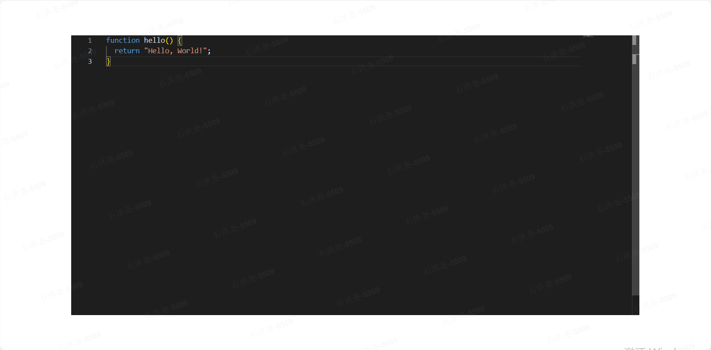

<script setup>
import Editor from "../../../components/editor.vue"
</script>


# Monaco Editor
---

[Monaco Editor](https://microsoft.github.io/monaco-editor/) 是一款由微软开发的高性能代码编辑器，它是 Visual Studio Code (VS Code) 的核心组件，支持代码高亮、智能提示、代码折叠等 IDE 级功能，并可直接嵌入到 Web 应用中。在大部分的网页代码编辑场景下都会涉及到此库。

## Monaco Editor 的特点

- 支持主流编程语言的识别（JavaScript、Python、Java、C++ 等）
- 支持代码折叠、括号匹配、自动缩进、多光标编辑、查找替换、代码格式化
- 高度可定制： 自定义主题（亮色 / 暗色模式）、自定义快捷键
- 跨平台兼容：支持主流浏览器（Chrome、Firefox、Safari、Edge），响应式设计，适配移动设备

## 构造一个编辑器

### 使用 cdn 引入

Monaco Editor 可以通过 cdn 很简单的构造出一个代码编辑器，示例代码如下：

:::details index.html

``` html
<!DOCTYPE html>
<html>
<head>
  <meta charset="UTF-8">
  <meta name="viewport" content="width=device-width, initial-scale=1.0">
  <title>Monaco Editor</title>
  <!-- 引入 Monaco Editor -->
  <script src="https://cdn.tailwindcss.com"></script>
  <link href="https://cdn.jsdelivr.net/npm/font-awesome@4.7.0/css/font-awesome.min.css" rel="stylesheet">
  <script src="https://cdn.jsdelivr.net/npm/monaco-editor@0.38.0/min/vs/loader.min.js"></script>
  <style>
    body{
      height: 100vh;
      display: flex;
      justify-content: center;
      align-items: center;
    }
    #container{
      width: 80%;
      height: 80%;
    }
  </style>
</head>
<body>
  <div id="container" ></div>
</body>
<script>
  // 加载 Monaco Editor
  require.config({ paths: { 'vs': 'https://cdn.jsdelivr.net/npm/monaco-editor@0.38.0/min/vs' } });
  
  require(['vs/editor/editor.main'], function() {
    const editor = monaco.editor.create(document.getElementById('container'), {
      value: 'function hello() {\n  return "Hello, World!";\n}',
      language: 'javascript',
      theme: 'vs-dark',
      fontSize: 14,
      automaticLayout: true // 自动适应容器大小
    });
  });
</script>
</html>
```

:::

此时可以在页面上预览到一个类似vscode的编辑器。



### 使用 npm 引入

推荐通过 npm 包使用

```bash
npm install monaco-editor
```

:::details index.html

```html
<!DOCTYPE html>
<html lang="zh-CN">
<head>
  <meta charset="UTF-8">
  <meta name="viewport" content="width=device-width, initial-scale=1.0">
  <title>Document</title>
  <style>
    body{
      padding: 0;
      margin: 0;
      height: 100vh;
      display: flex;
      gap: 2em;
      padding-left: 2%;
      padding-top: 3%;
      background-color: rgb(255, 255, 255);
    }
    #container{
      width: 70%;
      height: 80%;
      border-color: rgb(255, 255, 255);
      background-color: rgb(86, 86, 86);
    }
    #control{
      display: flex;
      flex-direction: column;
      gap: 1em ;
    }
  </style>
</head>
<body>
  <div id="container" ></div>
  <div id="control">
    <label for=""><input type="color" name="" id=""> 注释颜色 </label>
    <label for=""><input type="color" name="" id=""> 编程语言关键字颜色 </label>
    <label for=""><input type="color" name="" id=""> 字符串字面量颜色 </label>
    <label for=""><input type="color" name="" id=""> 编辑器背景色 </label>
    <label for=""><input type="color" name="" id=""> 文本前景色 </label>
    <label for=""><input type="color" name="" id=""> 当前行高亮背景色 </label>
    <label for=""><input type="color" name="" id=""> 选中文本背景色 </label>
    <label for=""><input type="color" name="" id=""> 光标颜色 </label>
    <label for=""><input type="color" name="" id=""> 行号前景色 </label>
  </div>
  <script src="index.js" type="module"></script>
</body>
</html>

```

:::

:::details index.js

```js
import * as monaco from "monaco-editor"

const container = document.getElementById("container");
const colorInput = document.querySelectorAll("input[type=color]")
const text =await ((await fetch("./index.js")).text())
const themeColors = [
  "#577b48",
  "#6db3fd",
  "#be8770",
  "#1e1e1e",
  "#d4d4d4",
  "#3c3c3c",
  "#3c3c3c",
  "#d4d4d4",
  "#d4d4d4"
]

// 挂载内容和语言
const editor = monaco.editor.create(container,{
  value: text,
  language:"javascript",
  minimap:{
    enabled:false
  },
  lineNumbersMinChars: 2,
  scrollbar: {
    vertical: 'visible',
    horizontal: 'visible',
    verticalScrollbarSize: 12,
    horizontalScrollbarSize: 12,
    arrowSize: 16,
  },
   padding: {
    top: 12,
  }
})


// 定义和设置主题
monaco.editor.defineTheme("default-Theme",{
  base:"vs-dark", // 根主题
  inherit: true, // 是否继承现有主题
  rules: [
    { token: "comment", foreground: "577b48", fontStyle: "italic" }, // 注释颜色和字体样式
    { token: "keyword", foreground: "6db3fd" },// 编程语言关键字颜色
    { token: "string", foreground: "be8770" },// 字符串字面量颜色
  ],
  colors: {
    // 编辑器主体
    "editor.background": "#1e1e1e",
    "editor.foreground": "#d4d4d4",
    "editor.lineHighlightBackground": "#3c3c3c",
    "editor.selectionBackground": "#3c3c3c",

    "editorCursor.foreground": "#d4d4d4",
    "editorLineNumber.foreground": "#d4d4d4",
  },
})

editor.updateOptions({ theme: "default-Theme" }); // 设置单个编辑器主题

function updateThemeColor(colors){
  monaco.editor.defineTheme("update-theme",{
    base:"vs-dark",
    inherit:true,
    rules: [
      { token: "comment", foreground: colors[0], fontStyle: "italic" }, // 注释颜色和字体样式
      { token: "keyword", foreground: colors[1] },// 编程语言关键字颜色
      { token: "string", foreground: colors[2] },// 字符串字面量颜色
    ],
    colors:{
      "editor.background": colors[3],
      "editor.foreground": colors[4],
      "editor.lineHighlightBackground": colors[5],
      "editor.selectionBackground": colors[6],
      "editorCursor.foreground": colors[7],
      "editorLineNumber.foreground": colors[8],
    }
  })
  monaco.editor.setTheme("update-theme") // 设置全局编辑器主题
}

colorInput.forEach((item,index)=>{
  item.value = themeColors[index]
  console.log(item.value)
  item.addEventListener("input",(e)=>{
    console.log(e.target.value)
    themeColors[index] = e.target.value
    updateThemeColor(themeColors)
  })
})

// 屏蔽编辑器右键菜单
editor.getDomNode().addEventListener('contextmenu', function(e) {
  // 阻止 Monaco Editor 默认的右键菜单
  e.stopPropagation();
  // 允许浏览器原生菜单
  return true;
}, true);

// 页面大小变化时编辑器一同变化
const resizeObserver = new ResizeObserver(() => {
  editor.layout(); // 通知编辑器更新布局
});

resizeObserver.observe(container);

console.log(monaco.languages.getLanguages())
```

:::

在目录下执行 

```bash
npx vite
```

运行结果如下：

<div id="container">
  <Editor />
</div>

<style>
#container {
  width: 45em;
  height: 30em;
  box-shadow: 0px 0px 2px rgba(0, 0, 0, 0.5);
}
</style>


## 主题定制

Monaco Editor 可以通过设置主题参数来自定义编辑器样式，主题颜色参数控制编辑器的整体视觉风格，包括背景色、文本颜色、光标颜色等，主要分为**全局颜色变量**和**语法高亮规则**。在前面的实例中可以手动修改颜色参数查看部分主题效果。

### 全局颜色变量

全局颜色变量控制编辑器的整体外观，如背景、行号、光标等。常用变量包括：

| 参数名                              | 描述                                 | 示例值                |
|-------------------------------------|--------------------------------------|-----------------------|
| editor.background                   | 编辑器背景色                         | #1E1E1E（深色）       |
| editor.foreground                   | 编辑器文本默认颜色                   | #D4D4D4（浅色）       |
| editorLineNumber.foreground         | 行号颜色                             | #5A5A5A（灰色）       |
| editorCursor.foreground             | 光标颜色                             | #AEAFAD（浅灰色）     |
| editor.selectionBackground          | 选中文本背景色                       | #264F78（蓝色调）     |
| editor.inactiveSelectionBackground  | 非活动选中区域背景色                 | #3A3D41（暗灰色）     |
| editor.selectionHighlightBackground | 与选中内容相似文本的高亮背景色       | #264F7833（半透明蓝色）|
| editor.wordHighlightBackground      | 光标所在单词的高亮背景色             | #0F4A8526（浅蓝）     |
| editor.lineHighlightBackground      | 当前行高亮背景色                     | #2C2C2C（深灰色）     |
| editorWhitespace.foreground         | 空白字符（空格、制表符）的颜色       | #3B3B3B（极暗灰色）   |
| editorIndentGuide.background        | 缩进辅助线颜色                       | #404040（灰色）       |
| editorRuler.foreground              | 标尺线颜色（如 80 列限制线）         | #808080（中灰色）     |
| editorError.foreground              | 错误提示波浪线颜色                   | #F44747（红色）       |
| editorWarning.foreground            | 警告提示波浪线颜色                   | #FFCC00（黄色）       |
| editorInfo.foreground               | 信息提示波浪线颜色                   | #007ACC（蓝色）       |

### 语法高亮规则（Token Colors）

语法高亮规则控制不同代码元素（如关键字、字符串、注释）的颜色。每个规则由 token（匹配的元素类型）和 foreground（前景色）组成。常见的 token 类型包括：

| Token 类型         | 描述                                   |
|--------------------|----------------------------------------|
| comment            | 注释（单行、多行、文档注释）           |
| keyword            | 关键字（如 function, if, class）        |
| string             | 字符串（单引号、双引号、模板字符串）    |
| number             | 数字                                   |
| operator           | 操作符（如 +, -, *, /）                |
| identifier         | 标识符（变量名、函数名）               |
| type               | 类型（如 TypeScript 中的 string, number）|
| decorator          | 装饰器（如 TypeScript 中的 @Component） |
| regexp             | 正则表达式                             |
| tag                | HTML/XML 标签                          |
| attribute.name     | HTML/XML 属性名                        |
| attribute.value    | HTML/XML 属性值                        |


### 设置主题示例

```js
monaco.editor.defineTheme('myCustomTheme', {
  base: 'vs-dark', // 继承自 vs-dark 主题
  inherit: true,
  rules: [
    // 语法高亮规则
    { token: 'comment', foreground: '008800' }, // 绿色注释
    { token: 'keyword', foreground: 'FF0000' }, // 红色关键字
    { token: 'string', foreground: '0000FF' },  // 蓝色字符串
    { token: 'number', foreground: 'FF8C00' },  // 橙色数字
    { token: 'operator', foreground: 'D4D4D4' }, // 灰色操作符
    
    // 特定语言的 token
    { token: 'keyword.control.flow.javascript', foreground: 'E5C07B' }, // JavaScript 控制流关键字
    { token: 'entity.name.function', foreground: '61AFEF' }, // 函数名
    { token: 'variable', foreground: '9CDCFE' }, // 变量
    { token: 'type.identifier', foreground: '569CD6' } // 类型标识符
  ],
  colors: {
    // 全局颜色变量
    'editor.background': '#1E1E1E',
    'editor.foreground': '#D4D4D4',
    'editorLineNumber.foreground': '#5A5A5A',
    'editorCursor.foreground': '#AEAFAD',
    'editor.selectionBackground': '#264F78',
    'editor.inactiveSelectionBackground': '#3A3D41',
    'editor.selectionHighlightBackground': '#264F7833',
    'editor.wordHighlightBackground': '#0F4A8526',
    'editor.lineHighlightBackground': '#2C2C2C',
    'editorWhitespace.foreground': '#3B3B3B',
    'editorIndentGuide.background': '#404040',
    'editorRuler.foreground': '#808080',
    'editorError.foreground': '#F44747',
    'editorWarning.foreground': '#FFCC00',
    'editorInfo.foreground': '#007ACC'
  }
});
```