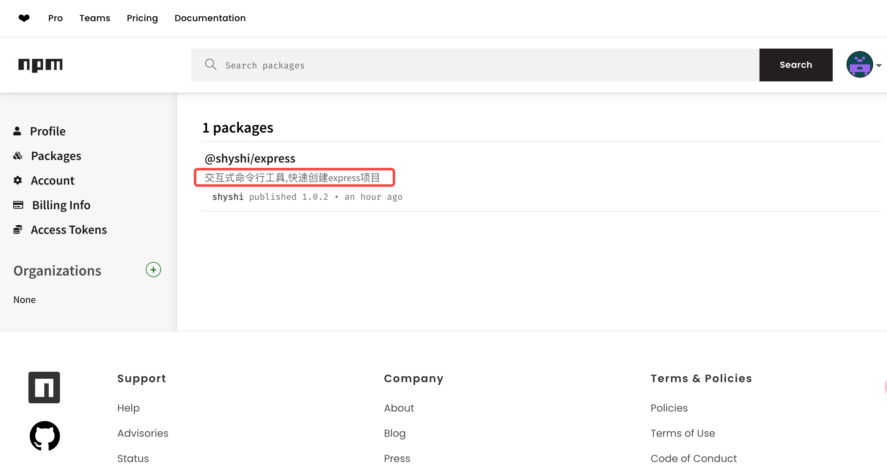

# 发布 npm 包

## 前提条件

- 在[npm官网](https://www.npmjs.com/)注册一个账号
- 一个标准的 npm 项目，包含 `package.json` 文件

## 必要的 package.json 字段

发布 npm 包时，需要配置以下必要字段

- `name` 包名，必须唯一，不能与 npm 官网已有的包名冲突
- `version` 版本号，遵循 [semver](https://semver.org/) 规范。例如，`1.2.3` 表示主版本号为 1（重大修改版本，不一定兼容旧版本，比如vue2｜vue3，python2｜python3），次版本号为 2（新功能，向下兼容），修订版本号为 3（bug修复，向下兼容）。
- `description` 包的描述 ，发布后会出现在 npm 官网的包检索页
- `main` 包的入口文件，通常是 `index.js` 文件。程序入口，从这里开始打包发布
- `bin` 包执行的命令。例如， `"express-server": "./index.js"` 表示通过 `express-server` 命令执行 `index.js` 文件
- `publishConfig` 发布配置。`publishConfig.access` 配置发布权限，有 `public` 和 `private` 两种。`publishConfig.registry` 配置发布仓库地址，默认是 `https://registry.npmjs.org/`。
- `keywords` 关键词，发布后会出现在 npm 官网的包检索页，用于检索
- `author` 作者名，发布后会出现在 npm 官网的包详情页
- `license` 许可证，开源许可说明，发布后会出现在 npm 官网的包详情页
- `private` 是否私有，`true` 表示私有，`false` 表示公开。默认为 `true`，只要设置为 `false` 才能发布。

:::warning 关于 `license` 字段

`license` 字段是许可证，开源许可说明。常见的许可证有 `MIT`、`Apache`、`BSD`、`GPL`、`LGPL`、`ISC` 等。
更多可参考[这里](https://zhuanlan.zhihu.com/p/62578705)

:::

## 发布

完成 `package.json` 的配置后，通过下面的流程进行 npm 包发布

```bash

npm login # 登录 ，已登陆可以忽略

npm publish # 发布
```

:::warning 注意事项

登录和发布时要注意 `npm` 的源，默认是 `https://registry.npmjs.org/`，如果是其他源，可以通过 `npm config set registry <registry>` 配置。

:::

:::details 发布成功后的命令行提示

```bash
✗ npm publish
npm notice
npm notice 📦  @shyshi/express@1.0.5
npm notice Tarball Contents
npm notice 479B README.md
npm notice 1.1kB index.js
npm notice 1.3kB input.js
npm notice 531B package.json
npm notice 1.1kB template_git/app.js
npm notice 1.7kB template_git/bin/www
npm notice 21.2kB template_git/package-lock.json
npm notice 508B template_git/package.json
npm notice 290B template_git/public/index.html
npm notice 111B template_git/public/style/style.css
npm notice 1.1kB template_git/routes/index.js
npm notice 475B template_git/routes/users.js
npm notice 1.1kB template/app.js
npm notice 1.7kB template/bin/www
npm notice 21.1kB template/package-lock.json
npm notice 508B template/package.json
npm notice 290B template/public/index.html
npm notice 111B template/public/style/style.css
npm notice 1.1kB template/routes/index.js
npm notice 475B template/routes/users.js
npm notice Tarball Details
npm notice name: @shyshi/express
npm notice version: 1.0.5
npm notice filename: shyshi-express-1.0.5.tgz
npm notice package size: 11.0 kB
npm notice unpacked size: 56.3 kB
npm notice shasum: 5000ca3a4c4f39018c3f14ed19ff27cca5460105
npm notice integrity: sha512-N5rlTJyPflugK[...]StbctMyBH5TDw==
npm notice total files: 20
npm notice
npm notice Publishing to https://registry.npmjs.org/ with tag latest and public access
+ @shyshi/express@1.0.5
```
:::

发布完成后，可以在 [npm 官网](https://www.npmjs.com) 查看




## 更新

更新 npm 包时，只需要修改 `package.json` 中的 `version` 字段，然后重新发布即可。

```bash
npm version patch # 更新版本号
npm publish # 发布
```

:::tip 提示

更新版本命令时会自动更新 `package.json` 中的 `version` 字段，并提交 git commit 

- `npm version major` 更新主版本号
- `npm version minor` 更新次版本号
- `npm version patch` 更新修订版本号

:::


## 使用发布的 npm 包

发布后就可以像使用其他 npm 包一样使用自己的 npm 包，这里以 `@shyshi/express` 为例，介绍如何使用发布的 npm 包


### npm 全局安装使用
```bash
npm install -g @shyshi/express
```
这是一个 express 项目的脚手架，安装后可以通过 `express-server` 命令快速生成一个 express 项目

运行命令
```bash
express-server

✔ 请输入项目名称 my-project
✔ 是否启用git进行版本管理 Yes


项目创建成功
cd my-project
npm install
npm run start
```

### 通过 npx 使用

使用 npx 直接运行 npm 包，不需要安装。[npm 和 npx](/other/more/#npm-和-npx-的区别)
```bash
npx @shyshi/express

✔ 请输入项目名称 my-project
✔ 是否启用git进行版本管理 Yes


项目创建成功
cd my-project
npm install
npm run start
```

这样就成功发布了一个 npm 包并成功使用
