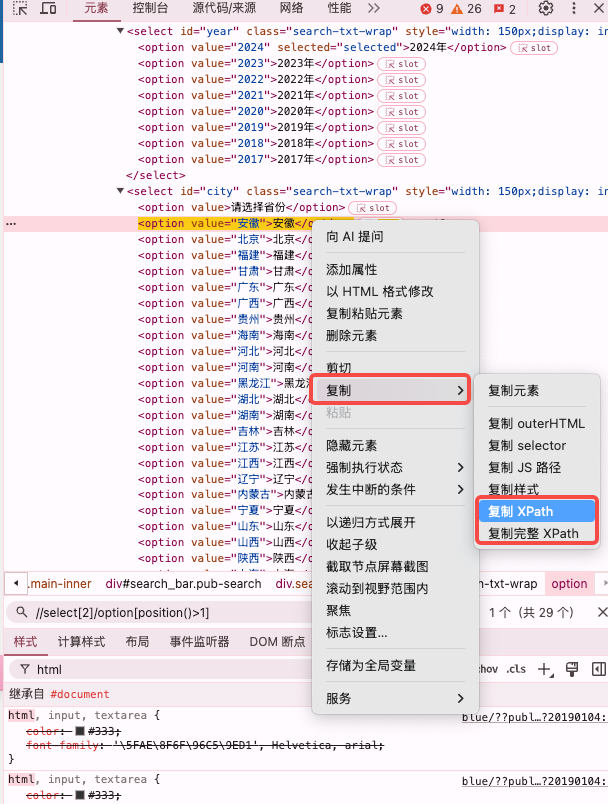

# XPath
---
XPath: 网页中定位html（包含XML）元素的语法
## 获取XPath的方式
### 通过浏览器的开发者工具，找的元素右键，选择复制--->复制XPath

### 通过语法规则自定义
1. 使用位置顺序
以下是一个XPath：
`/html/body/div[3]/div/div/div[2]/div/div[3]/div/select[2]/option[2]`
它表示  `html -> body -> div(第3个) ->div ->div ->div(第2个)->div->div(第3个)->select(第2个)->option(第2个)`
这个XPath通过元素的标签名称和位置顺序来定位html元素，
2. 使用属性
除了使用位置顺序，html还可以使用元素的属性定位（这中方式可以避免因为文档树变化导致定位不准）
例如： `//div[@id="box"]/span`
这个XPath表示  `div[id="box"] ->span`       在文档树中id为box的div内的第一个span元素

:::warning 注意
  属性名称前要加‘@’，可以使用‘//’来省略前面的元素
:::
3. 使用函数
这里只展示一部分
  - text()    用文本定位位置
  `text()='xxx' `            精确定位，引号中的内容需与HTML文档中的文本完全一样
  例如：
  `p[text()="标题"]`   文本内容为‘标题’的p标签
  - position   用于定位节点的位置和限制节点的范围
  `position()=1`                                    同级标签的第1个
  `position()>1 and position()<10`          同级标签的第2-9个
  例如：
  `/html/body/div[position()>1 and position()<10 ]`  body下第2～9个div元素
  - contains()    用于判断文本的一部分是否包含XXX，或者属性值是否包含XXX
  `contains(text(),'xxx')`          判断文本的一部分是否包含XXX，
  `contains(@class,'xxx')`        判断属性值是否包含XXX
  例如：
  `img[contains(@class,'hidden')]`  类名为‘hidden’的img元素