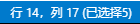

# vscodeAPI获取文本范围对象
--- 

vscode.TextEditor有以下属性：
1. `selection` : 当前选中的文本
  - `selection.active` : 
   `Position` 类型,当前光标位置,如果有选中的文本，这里是被选择文本的最后，细心的你会发现，选择了文本后，光标也是会存在的。如果只需要知道当前光标在哪，获取这个就对了
  - `selection.anchor` : 
  `Position` 类型,选择开始的位置,如果没有选中的文本，这个值与 selection.active 完全一致，但如果选中了文本，这里就是被选中文本的开始位置
- `selection.start` : 
  `Position` 类型,靠前的位置,这个值应该是以上两值的副本，Postion 会计算出以上两值中，靠前一值放到这来。line越小越前，line相同character越小越前
- `selection.end`:
  `Position` 类型 ,靠后的位置,同上，两值中靠后一值放到这来
2. `selections`:
  `Array<Position>`类型,vscode有个方便的功能，选中一处代码之后，按ctrl+d可以把当前编辑器中相同的代码一起选中，这就会出现多个选中区域，所以这个属性是把所有选中区域都记录上了。并且它的第一个子项，肯定是用户一开始选中的那个区域
3. `vscode.Position` :
  这是vscode的位置类型，用于表达文本编辑器里的位置，有两个属性：line和character
关注过vscode下面信息栏的下面这个信息，就知道这两个属性表达的意思了。

但是这两个属性与上图有一个不一致的，上图是从1开始计数，而 position 的两个属性是从0开始计数