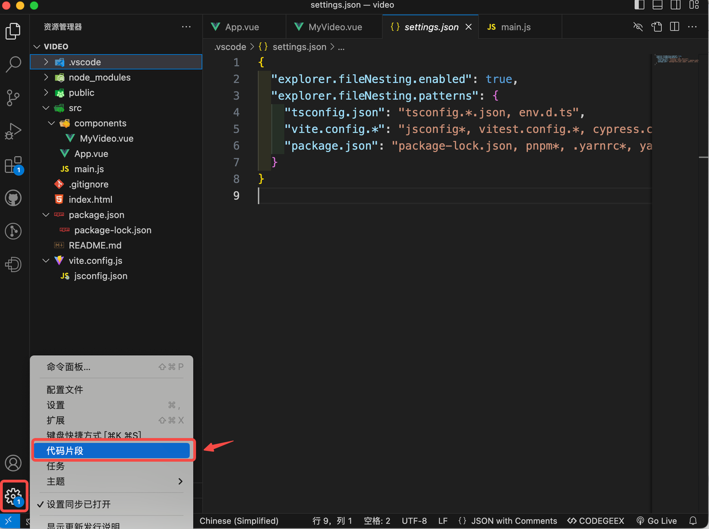
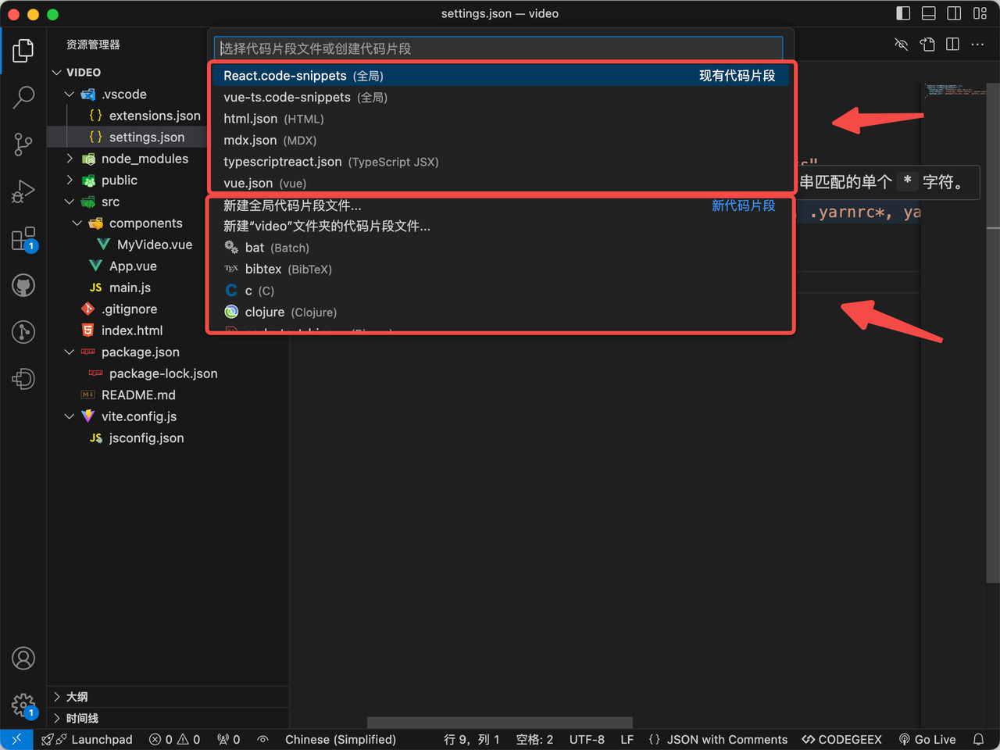
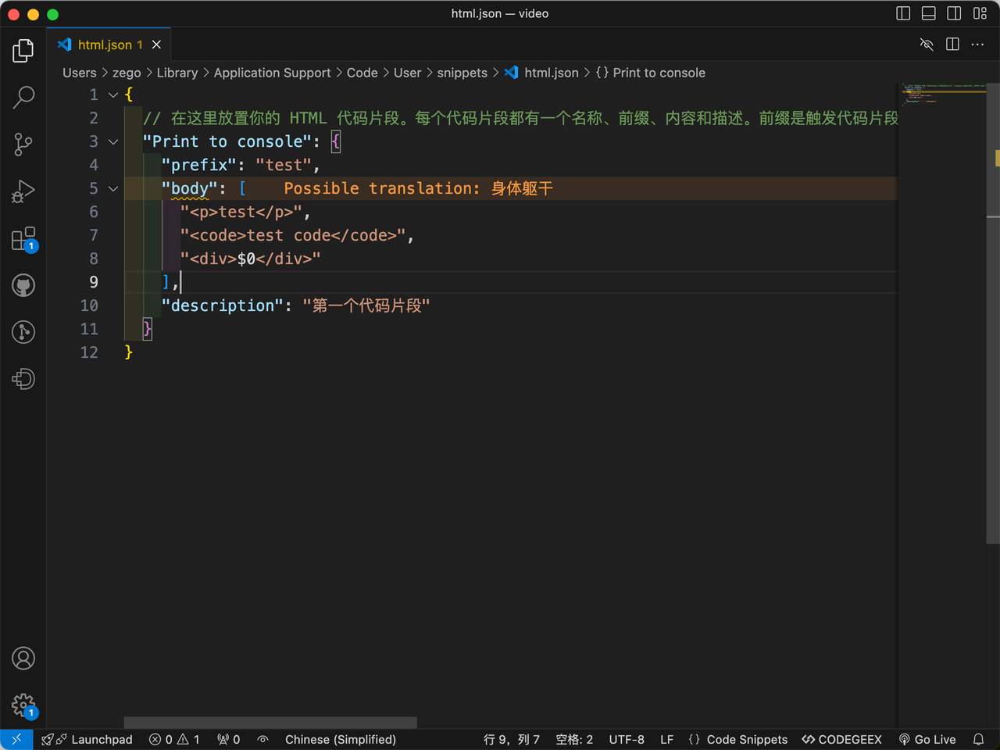
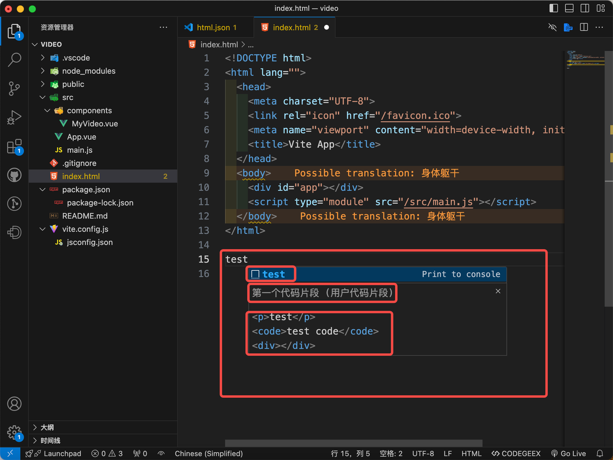
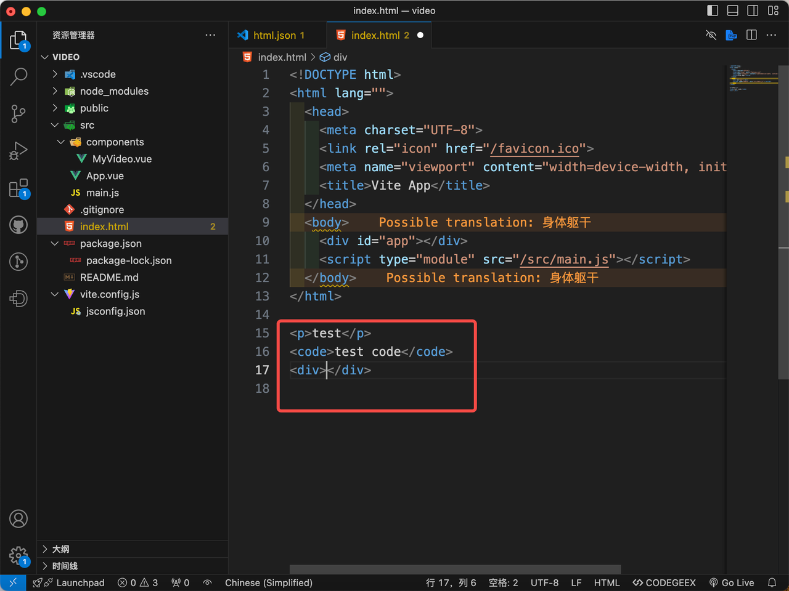
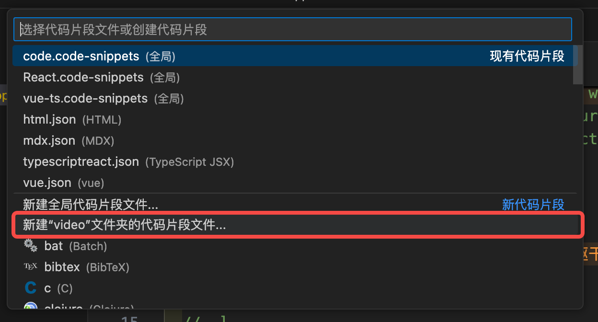
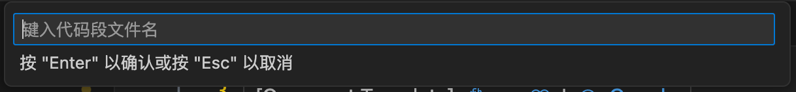
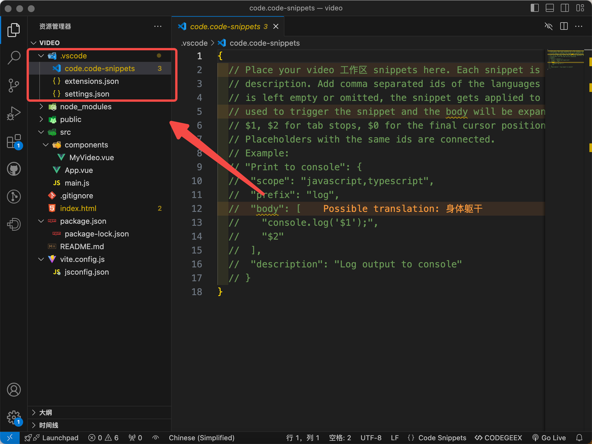
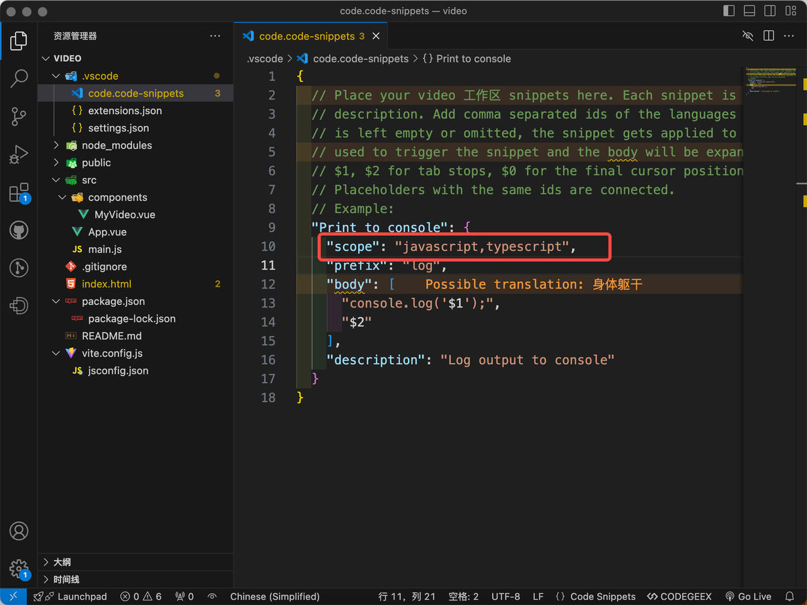
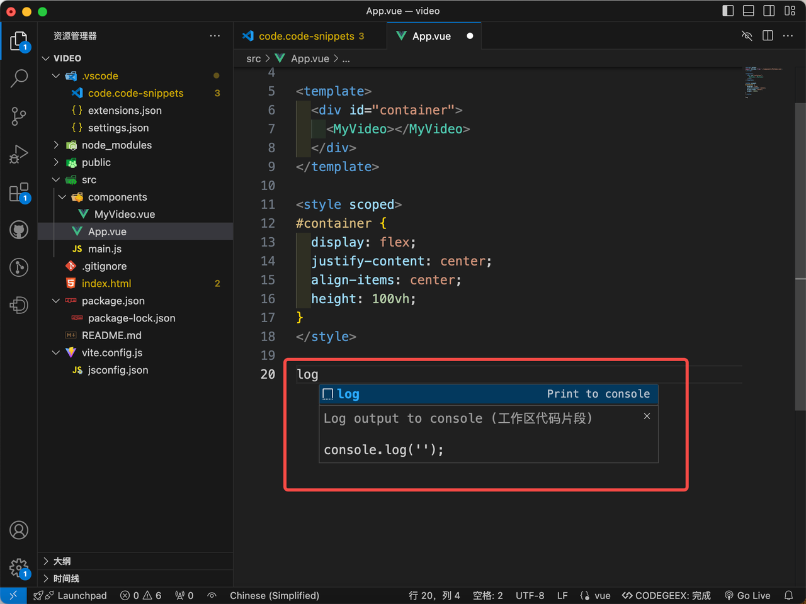

# vscode用户代码片段的使用
---

vs code 用户代码片段可以实现，用特定指令生成预设的代码块。用户代码片段是一个json配置文件，按照指定的格式书写即可生效。
这里要留意两点：
1. 全局用户代码片段的作用范围是指定文件类型的，例如，html.json的代码片段只对html文件生效
2. 用户代码片段分全局代码片段和项目代码片段（文件夹），全局是对所有指定类型的文件生效，项目是对当前项目的文件（任意）生效

## 配置用户代码片段
通过 `设置->代码片段` 打开
 
上面的是已经配置过（已拥有）的代码片段，下面的是还没有配置对应文件类型的代码片段
选择html.json配置html文件的全局代码片段

```json
{
  // 在这里放置你的 HTML 代码片段。每个代码片段都有一个名称、前缀、内容和描述。前缀是触发代码片段的关键词，内容将被展开和插入。可能的变量有：$1、$2 用于标签停止，$0 用于最终光标位置，${1:label}、${2:another} 用于占位符。具有相同 id 的占位符是连接的。
  "Print to console": {
    "prefix": "test",
    "body": [
      "<p>test</p>",
      "<code>test code</code>",
      "<div>$0</div>"
    ],
    "description": "第一个代码片段"
  }
}
```

这里是固定的配置格式，（$0的作用是代码片段生成后光标的停放位置）
```json
{
 "Print to console": {
    "prefix": "",
    "body": [],
    "description": ""
  }
}
```

字段说明：
prefix：生产代码片段的指令名称
body：生成的代码片段内容（这里是一个字符串数组，每个数组元素间会自动换行）
description：代码片段的描述

配置完成后打开一个html文件输入指令test

可以观察到每个字段的效果，回车即可生成代码片段替换掉指令

这样就实现了，通过简短的指令，快速生成任意长度的代码片段，在一些大量重复的代码书写情况下可以大大提高书写效率

## 配置项目代码片段
选择新建【当前】文件夹的代码片段文件


输入文件名称回车，此时会在当前目录下生成.vscode文件夹，并在此文件夹下生成.code-snippets文件，这里就可以配置当前项目的代码片段
 

可以注意到这里多了一个scope字段，它可以用来限定项目中，代码片段生效的文件类型(删掉该字段则当前项目中所有文件都可以生效)
```json
{
  "Print to console": {
    // "scope": "javascript,typescript",
    "prefix": "log",
    "body": [
      "console.log('$1');",
      "$2"
    ],
    "description": "Log output to console"
  }
}
```

